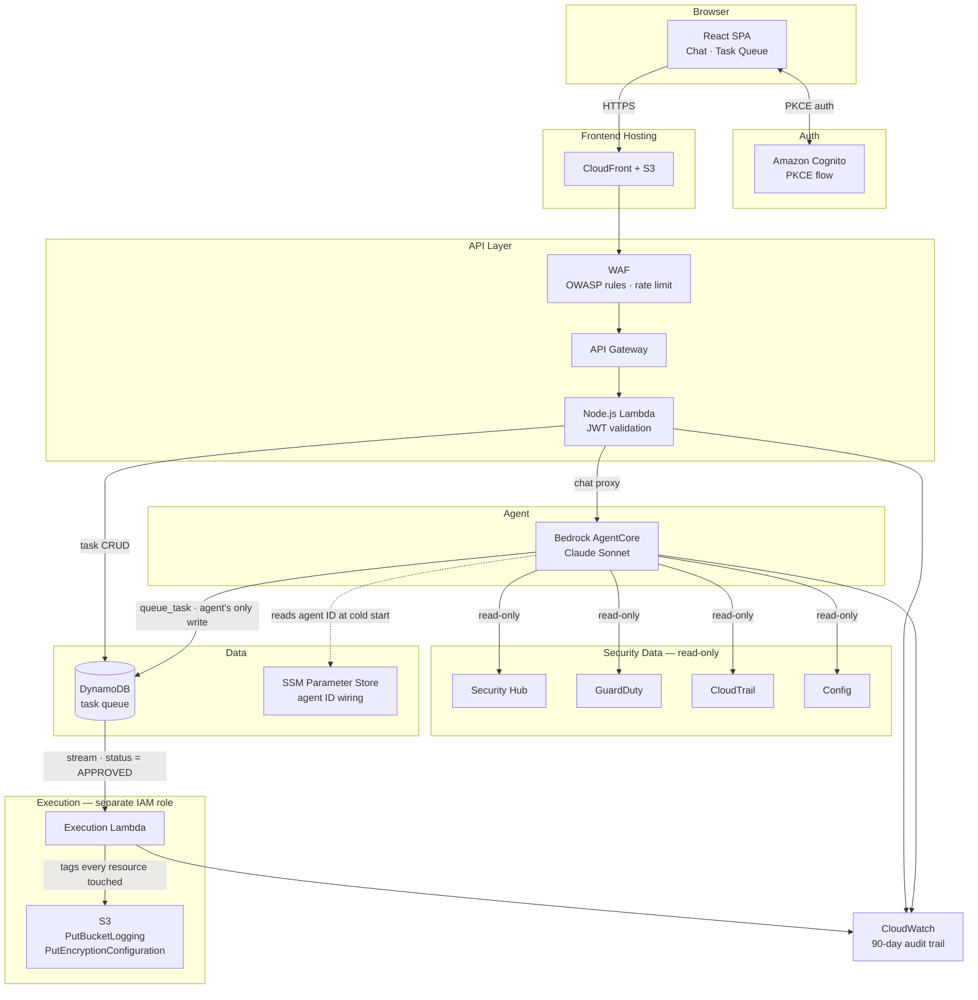

# Security Triage Agent

An AI-powered AWS security operations agent built on Bedrock AgentCore and Claude Sonnet. Analysts chat with it in plain English to investigate Security Hub findings — the agent enriches them with GuardDuty, Config, and CloudTrail context, proposes specific remediation actions with rationale, and executes them only after explicit human approval.

---

## The problem

Enterprise AWS environments typically run dozens to hundreds of accounts. Security Hub aggregates findings from all of them into a central security account — which means a single analyst can be looking at thousands of active findings across Security Hub, GuardDuty, Config, and CloudTrail at once.

You can enable email or SNS notifications, but that just moves the problem: you get hundreds of alerts a day, most of them noise, and the signal-to-noise ratio degrades until analysts start ignoring them. What you actually need is triage — understanding which findings matter, why, and what to do about them.

That triage currently looks like this:
- Open Security Hub, find a critical finding
- Cross-reference GuardDuty to see if there's active threat activity on that resource
- Check Config to understand the compliance history — was this always misconfigured, or did something change?
- Search CloudTrail to find who made the change and when
- Decide whether to act, and if so, execute the change manually — hoping you got the right resource ARN and didn't miss a dependency

Each finding can take 15–30 minutes to triage properly. Most don't get that attention. They sit in the queue, the finding count climbs, and the security posture silently degrades.

## The solution

This agent gives security professionals a conversational interface to their AWS security posture. Instead of context-switching across four consoles, an analyst types a question and gets a synthesised answer backed by live data from all four sources.

**Day-to-day it looks like this:**

- *"What's the most critical finding in the payments account right now?"* → agent pulls Security Hub, checks GuardDuty for correlated threat activity, and returns a plain-English summary with severity context.
- *"Was that S3 bucket always public, or did something change recently?"* → agent queries Config history and CloudTrail to reconstruct what happened and who did it.
- *"Queue a fix for all unencrypted buckets in the data-lake account."* → agent identifies the non-compliant resources, proposes individual remediation tasks with rationale, and surfaces them in the approval queue.
- *"What have you queued this week?"* → agent returns a summary of pending, approved, and executed tasks across all findings.

The analyst stays in control. The agent never touches AWS resources — it only proposes. A separate, narrowly-scoped Execution Lambda carries out approved actions, tagging every resource it touches for the audit trail.

In a multi-account environment, Security Hub's aggregated view means the agent works across all member accounts from a single deployment in the delegated administrator account — no per-account setup required.

---

## Architecture



**Key design constraints:**
- The agent IAM role has **zero write access** to AWS services. Its only write action is `DynamoDB PutItem`.
- The Execution Lambda runs under a **separate, narrowly-scoped IAM role** — it cannot be invoked directly, only via a DynamoDB stream event where `status = APPROVED`.
- Every S3 action tags the resource with `security-agent-action: true` and an execution timestamp.
- No AWS credentials ever reach the browser — all traffic is proxied through the API Lambda.

---

## Analyst workflow

1. Analyst opens the chat UI — the agent automatically fetches the latest Security Hub findings and summarises the most critical one.
2. Analyst asks follow-up questions in plain English: *"What's the blast radius of that finding?"*, *"Queue a fix for the unencrypted buckets."*
3. The agent enriches findings with GuardDuty threat context, Config compliance history, and CloudTrail events, then proposes a remediation task with rationale.
4. The proposed task appears in the Task Queue panel — action, resource ARN, and plain-English rationale visible.
5. Analyst clicks **Approve** or **Reject**.
6. On approval, the DynamoDB stream triggers the Execution Lambda — the change is made, the task updates to `EXECUTED`.

---

## MVP scope

**In scope**
- Single analyst workflow
- Chat UI + Task Queue panel (two-panel layout)
- Agent investigates Security Hub findings on demand
- GuardDuty, Config, and CloudTrail enrichment
- Two autonomous actions: enable S3 access logging, enable S3 default encryption

**Out of scope (post-MVP)**
- Multi-user / role-based approval
- Email / Slack notifications
- Auto-approval or scheduled monitoring
- EBS / RDS encryption (disruptive — requires snapshot flow)

---

## Project structure

```
.
├── cdk/                          # AWS CDK infrastructure (TypeScript)
│   ├── bin/app.ts                # CDK app entry point — instantiates all stacks
│   └── lib/
│       ├── security-triage-stack.ts  # Core: Cognito, DynamoDB, Lambdas, API GW, WAF
│       ├── agent-stack.ts            # Bedrock AgentCore IAM role + auto-prepare resource
│       └── frontend-stack.ts         # S3 + CloudFront for React SPA
├── lambda/
│   ├── api/                      # Node.js API layer
│   │   ├── index.ts              # Handler entry point + CORS
│   │   ├── auth.ts               # Cognito JWT validation
│   │   ├── chat.ts               # Bedrock AgentCore proxy
│   │   └── tasks.ts              # Task queue CRUD
│   ├── agent-tools/              # Bedrock action group handler
│   │   └── index.ts              # get_findings, get_threat_context, queue_task, etc.
│   ├── agent-prepare/            # CDK custom resource — prepares agent after deploy
│   │   └── index.ts
│   └── execution/                # Execution Lambda — S3 remediation only
│       ├── index.ts              # Handler + DynamoDB stream parser
│       ├── enable-logging.ts     # S3 PutBucketLogging
│       └── enable-encryption.ts  # S3 PutEncryptionConfiguration
├── frontend/                     # React + Vite SPA
│   ├── src/
│   │   ├── App.tsx
│   │   ├── components/
│   │   │   ├── Chat.tsx          # Chat panel (right)
│   │   │   └── TaskQueue.tsx     # Task queue panel (left)
│   │   └── lib/
│   │       ├── auth.ts           # Cognito PKCE auth flow
│   │       └── api.ts            # API Gateway client
│   └── package.json
└── CLAUDE.md                     # AI agent instructions and architecture rules
```

---

## Stack

| Layer | Technology |
|---|---|
| Infrastructure | AWS CDK v2 (TypeScript) |
| Auth | Amazon Cognito — PKCE authorization code flow |
| API | API Gateway + Node.js 22 Lambda |
| Agent | AWS Bedrock AgentCore, Claude Sonnet 4.5 |
| Database | DynamoDB (single table, streams) |
| Storage | S3 + CloudFront |
| Security | WAF (OWASP rules + rate limiting) |
| Observability | CloudWatch (90-day log retention) |
| Frontend | React + Vite |

---

## Prerequisites

Two things that require manual action before deploying (AWS account-level gates — no API to automate):

1. **Bedrock model access** — enable **Claude Sonnet 4.5** (`us.anthropic.claude-sonnet-4-5-20250929-v1:0`)
   in the [Bedrock Model Access console](https://console.aws.amazon.com/bedrock/home#/modelaccess).
2. **AWS Security Hub** — enable it in the target region if not already active.

Everything else is handled by the deploy script.

Tools required on your machine:
- AWS CLI v2 (`aws configure` with admin permissions)
- Node.js 22+
- AWS CDK CLI: `npm install -g aws-cdk`
- **Git Bash** (Windows) — all scripts (`deploy.sh`, `deploy-frontend.sh`, `destroy.sh`) are bash scripts.
  Run them from Git Bash or with `bash ./deploy.sh ...` — they will not work in PowerShell directly.

---

## First-time deployment

### Step 1 — Deploy infrastructure

Run from **Git Bash** (not PowerShell):

```bash
bash ./deploy.sh --profile myprofile --region us-east-1 --owner you@example.com
```

This single script handles everything:
- Installs and builds all CDK and Lambda packages
- Bootstraps CDK in the target account/region (safe to re-run)
- Deploys all three stacks in the correct order
- Saves all CDK outputs to `cdk-outputs.json`
- Prints the two remaining manual commands with the correct IDs filled in

> **What CDK wires automatically:**
> - Cognito hosted UI domain (`security-triage-<account>.auth.<region>.amazoncognito.com`)
> - Cognito callback URLs (CloudFront + localhost for local dev)
> - `ALLOWED_ORIGIN` on the API Lambda (set to the CloudFront URL)
> - Bedrock Agent ID and alias ID written to SSM — API Lambda reads them at cold start

### Step 2 — Run the two commands printed by the script

The script prints these with the correct IDs filled in from `cdk-outputs.json`:

**a) Create the analyst account:**
```bash
aws cognito-idp admin-create-user \
  --user-pool-id <from script output> \
  --username analyst@example.com \
  --user-attributes Name=email,Value=analyst@example.com Name=email_verified,Value=true \
  --temporary-password "Temp1234!" \
  --message-action SUPPRESS
```

**b) Publish Cognito login branding** (one-time — without this the login page shows "unavailable"):
```bash
aws cognito-idp create-managed-login-branding \
  --user-pool-id <from script output> \
  --client-id <from script output> \
  --use-cognito-provided-values
```

### Step 3 — Configure the frontend

```bash
cp frontend/.env.example frontend/.env.local
```

Fill in `frontend/.env.local` — all values come from `cdk-outputs.json`:

```
VITE_API_URL=<ApiUrl>
VITE_USER_POOL_ID=<UserPoolId>
VITE_USER_POOL_CLIENT_ID=<UserPoolClientId>
VITE_COGNITO_DOMAIN=<CognitoDomain>
VITE_REDIRECT_URI=<DistributionUrl>/
```

### Step 4 — Deploy the frontend

```bash
bash ./deploy-frontend.sh --profile myprofile
```

Builds the React app, syncs to S3, and invalidates the CloudFront cache.

---

## Redeployment (subsequent changes)

**Infrastructure changes:**
```bash
bash ./deploy.sh --profile myprofile --region us-east-1 --owner you@example.com
```

**Frontend changes only:**
```bash
bash ./deploy-frontend.sh --profile myprofile
```

---

## Teardown (dev/test only)

Run from **Git Bash** (not PowerShell):

```bash
bash ./destroy.sh --profile myprofile --region us-east-1
```

The script will ask you to type `yes` to confirm, then:
1. Runs `cdk destroy --all` to remove all CloudFormation stacks
2. Deletes the four resources that have `RemovalPolicy: RETAIN` (DynamoDB table, Cognito User Pool, both S3 buckets)
3. Deletes the SSM parameters written by AgentStack
4. Cleans up local build artefacts (`cdk-outputs.json`, `cdk/cdk.out`)

> **Cognito domain propagation delay:** After destroy, wait ~2 minutes before running `./deploy.sh` again. Cognito domain prefix deletions take a moment to propagate globally — if `deploy.sh` fails with a domain conflict, just wait and re-run.

---

## Resources with RETAIN policy

The following resources survive `cdk destroy` to protect against accidental data loss.
`destroy.sh` handles their cleanup automatically. If you need to clean them up manually:

| Resource | Name | How to delete |
|---|---|---|
| DynamoDB table | `security-triage-tasks` | `aws dynamodb delete-table --table-name security-triage-tasks` |
| Cognito User Pool | `security-triage-analysts` | Console or `aws cognito-idp delete-user-pool --user-pool-id <id>` |
| S3 frontend bucket | `security-triage-frontend-{account}-{region}` | Empty then delete via console or CLI |
| S3 access logs bucket | `security-triage-access-logs-{account}-{region}` | Empty then delete via console or CLI |

If a **failed deploy** rolls back and leaves these resources, re-adopt them without data loss:

```bash
cd cdk && cdk import SecurityTriageStack
```

---

## Testing — three MVP scenarios

### Scenario 1 — Agent fetches findings on open

1. Open the CloudFront URL and log in.
2. Wait for the chat panel to load.
3. **Expected:** The agent sends an opening message summarising the most critical
   active Security Hub findings, in plain English, without you typing anything.

### Scenario 2 — Approve a task and verify execution

1. In the chat, type: *"Check if any S3 buckets are missing access logging and queue a fix."*
2. **Expected:** The agent queries Security Hub, identifies a non-compliant bucket,
   and queues a `enable_s3_logging` task visible in the Task Queue panel.
3. Click **Approve** on the task.
4. **Expected:** Task status changes to `APPROVED`, then shortly to `EXECUTED`.
5. Verify in the AWS console:
   - S3 bucket → Properties → Server access logging → Enabled
   - Bucket has tag `security-agent-action: true`

### Scenario 3 — Query the task queue

1. In the chat, type: *"What have you queued?"*
2. **Expected:** The agent returns a clear summary of pending and recent tasks,
   including the action, resource, and rationale for each.

If all three scenarios work, the MVP is complete.

---

## Troubleshooting

### "Login pages unavailable" on the Cognito hosted UI

Cognito Managed Login branding has not been published. Run:

```bash
aws cognito-idp create-managed-login-branding \
  --user-pool-id <USER_POOL_ID> \
  --client-id <APP_CLIENT_ID> \
  --use-cognito-provided-values
```

### "redirect_uri mismatch" after login

The callback URL registered in the Cognito app client does not exactly match
`VITE_REDIRECT_URI`. Common cause: trailing slash. Both must match exactly
(include the trailing slash: `https://dXXXX.cloudfront.net/`).

Check registered URLs:

```bash
aws cognito-idp describe-user-pool-client \
  --user-pool-id <USER_POOL_ID> \
  --client-id <APP_CLIENT_ID> \
  --query 'UserPoolClient.CallbackURLs'
```

### Agent returns "Agent not yet configured" (503)

AgentStack has not finished deploying yet, so the SSM parameters
(`/security-triage/agent-id`, `/security-triage/agent-alias-id`) do not exist.
Run `cdk deploy --all` and wait for AgentStack to complete, then retry.

### Agent returns stale responses (old model, old instructions)

The Bedrock Agent prod alias is pointing to an old version snapshot instead of DRAFT.
CDK configures the alias to point to DRAFT by default, so this should only happen if
the alias was manually changed. Fix:

1. Open **Bedrock → Agents → security-triage-agent → Aliases → prod**
2. Edit the alias — switch routing to DRAFT
3. Save

### "Access denied" calling Bedrock

The AgentCore IAM role is missing permissions for the cross-region inference profile.
Verify the role (`security-triage-agentcore`) has:

```json
{
  "Action": [
    "bedrock:InvokeModel",
    "bedrock:InvokeModelWithResponseStream",
    "bedrock:GetInferenceProfile"
  ],
  "Resource": [
    "arn:aws:bedrock:us-east-1:<account>:inference-profile/us.anthropic.claude-sonnet-4-5-20250929-v1:0",
    "arn:aws:bedrock:us-east-1::foundation-model/anthropic.claude-sonnet-4-5-20250929-v1:0",
    "arn:aws:bedrock:us-east-2::foundation-model/anthropic.claude-sonnet-4-5-20250929-v1:0",
    "arn:aws:bedrock:us-west-2::foundation-model/anthropic.claude-sonnet-4-5-20250929-v1:0"
  ]
}
```

### "Failed to fetch" on first request after a long idle

Lambda cold starts chaining across API Lambda → AgentCore → Agent Tools Lambda
can exceed the API Gateway 29-second timeout. This is expected behaviour on a
lightly-used deployment. The second request in the same session will succeed.
To mitigate, add an EventBridge rule that pings the API Lambda every 5 minutes.

### Task stays PENDING after approval

The Execution Lambda is triggered by the DynamoDB stream. Check:

1. Stream is enabled on the `security-triage-tasks` table (NEW_AND_OLD_IMAGES)
2. Execution Lambda has an event source mapping for the stream
3. CloudWatch Logs for `security-triage-execution` for errors

### CORS errors in the browser

`ALLOWED_ORIGIN` is set automatically by CDK to the CloudFront URL. If you are seeing
CORS errors, check that SecurityTriageStack was deployed **after** FrontendStack
(which happens automatically with `cdk deploy --all`). If stacks were deployed
individually out of order, redeploy SecurityTriageStack:

```bash
cd cdk && cdk deploy SecurityTriageStack
```

---

## Security architecture

- **The agent has zero write access to AWS services.** Its only write action is `DynamoDB PutItem` to queue a task.
- **Only the Execution Lambda writes to AWS resources**, and only the two permitted S3 actions.
- **The Execution Lambda is triggered exclusively by a DynamoDB stream event** where `status = APPROVED`. It cannot be invoked directly.
- **Every S3 action tags the resource** with `security-agent-action: true` and an execution timestamp.
- **No AWS credentials reach the browser.** All traffic is proxied through the API Lambda.
- **Every API request requires a valid Cognito JWT**, validated by both API Gateway and the Lambda (defence in depth).
- **PKCE authorization code flow** — no tokens exposed in the browser URL hash.
- **WAF** enforces OWASP common rules, known bad input blocking, and a 500 req / 5 min rate limit per IP.

---

## Task queue

Tasks move through these states only:

```
PENDING → APPROVED → EXECUTED
PENDING → REJECTED
```

| Field | Description |
|---|---|
| `task_id` | UUID |
| `status` | PENDING \| APPROVED \| REJECTED \| EXECUTED \| FAILED |
| `finding_id` | Security Hub finding ID |
| `resource_id` | ARN of the affected resource |
| `action` | `enable_s3_logging` or `enable_s3_encryption` |
| `rationale` | Why the agent proposes this action |
| `risk_tier` | Always 1 for MVP |
| `approved_by` | Analyst email (set on approval) |

---

## Development

```bash
# CDK
cd cdk && npm run build    # compile TypeScript
cd cdk && npm run watch    # watch mode

# API Lambda
cd lambda/api && npm install && npm run build

# Execution Lambda
cd lambda/execution && npm install && npm run build

# Frontend (local dev — points at deployed API)
cd frontend && npm run dev
```
