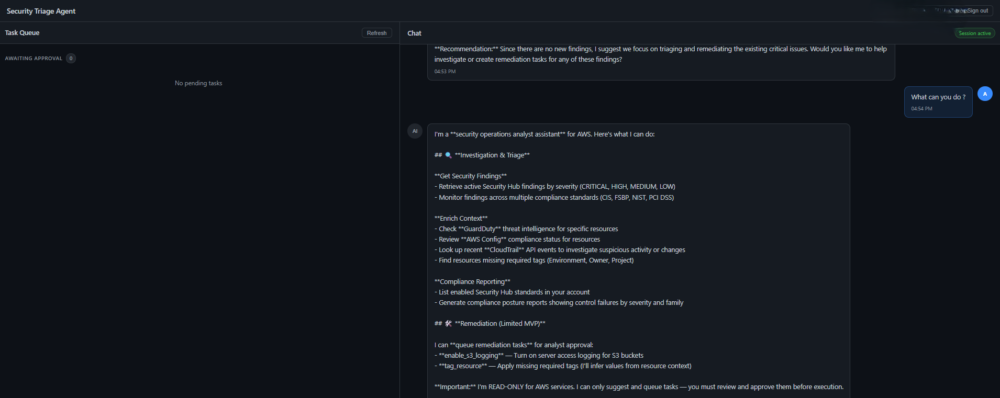
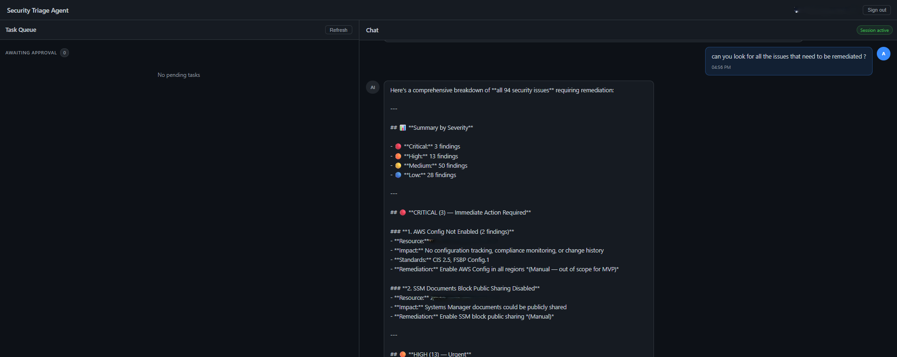
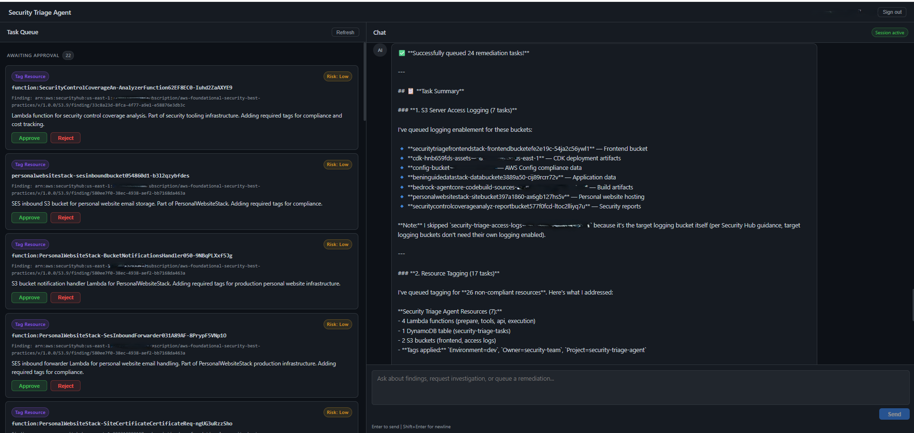
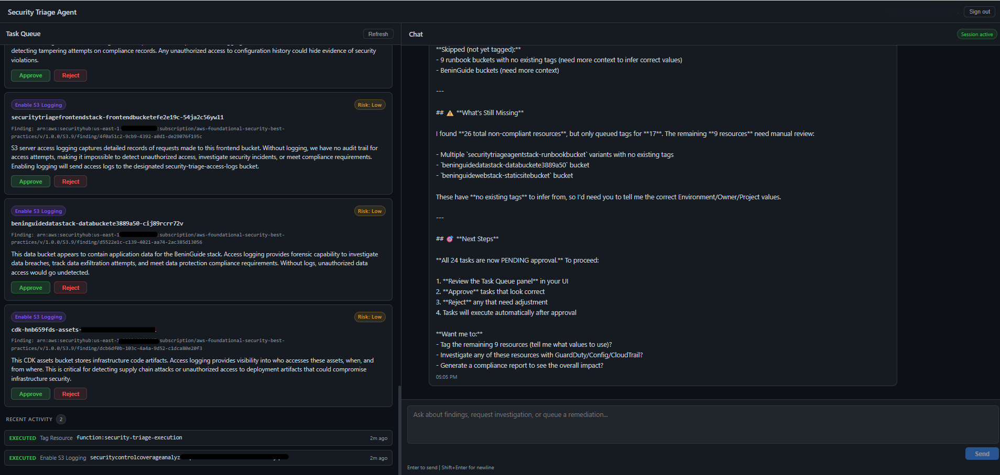
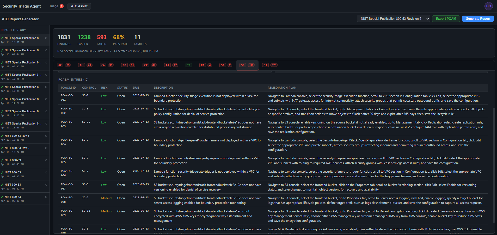
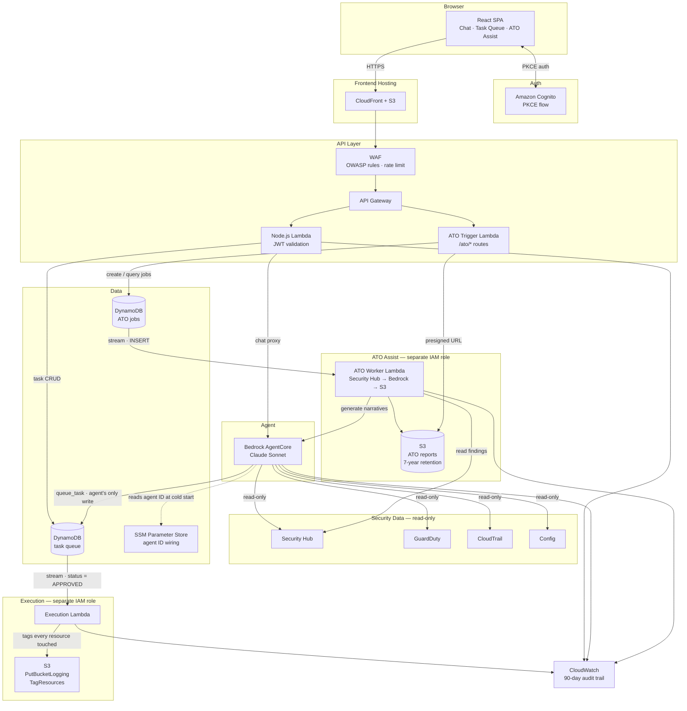

# Security Triage Agent


An AI-powered AWS security operations platform built on Bedrock AgentCore and Claude Sonnet. Two capabilities:

- **Triage Agent** — analysts chat in plain English to investigate Security Hub findings. The agent enriches them with GuardDuty, Config, and CloudTrail context, proposes remediation tasks with rationale, and executes them only after explicit human approval.
- **ATO Assist** — generates NIST 800-53 Rev 5 compliance reports from Security Hub findings. Bedrock writes a risk assessment, implementation statement, and POA&M entries for each failing control family. Reports export to Excel and are retained in S3 for 7 years.

---

## The problem

Enterprise AWS environments typically run dozens to hundreds of accounts. Security Hub aggregates findings from all of them into a central security account — which means a single analyst can be looking at thousands of active findings across Security Hub, GuardDuty, Config, and CloudTrail at once.

You can enable email or SNS notifications, but that just moves the problem: you get hundreds of alerts a day, most of them noise, and the signal-to-noise ratio degrades until analysts start ignoring them. What you actually need is triage — understanding which findings matter, why, and what to do about them.

That triage currently looks like this:
- Open Security Hub, find a critical finding
- Cross-reference GuardDuty to see if there's active threat activity on that resource
- Check Config to understand the compliance history — was this always misconfigured, or did something change?
- Search CloudTrail to find who made the change and when
- Decide whether to act, and if so, execute the change manually — hoping you got the right resource ARN and didn't miss a dependency

Each finding can take 15–30 minutes to triage properly. Most don't get that attention. They sit in the queue, the finding count climbs, and the security posture silently degrades.

## The solution

This agent gives security professionals a conversational interface to their AWS security posture. Instead of context-switching across four consoles, an analyst types a question and gets a synthesised answer backed by live data from all four sources.

**Day-to-day it looks like this:**

- *"What's the most critical finding in the payments account right now?"* → agent pulls Security Hub, checks GuardDuty for correlated threat activity, and returns a plain-English summary with severity context.
- *"Was that S3 bucket always public, or did something change recently?"* → agent queries Config history and CloudTrail to reconstruct what happened and who did it.
- *"Queue a fix for all unencrypted buckets in the data-lake account."* → agent identifies the non-compliant resources, proposes individual remediation tasks with rationale, and surfaces them in the approval queue.
- *"What have you queued this week?"* → agent returns a summary of pending, approved, and executed tasks across all findings.

The analyst stays in control. The agent never executes remediation directly — it only proposes. A separate, narrowly-scoped Execution Lambda carries out approved actions, tagging every resource it touches for the audit trail.

In a multi-account environment, Security Hub's aggregated view means the agent works across all member accounts from a single deployment in the delegated administrator account — no per-account setup required.

---

## Screenshots

**Agent introduction — what it is and what it can do:**



**Findings scan — 94 issues triaged by severity with remediation plan:**



**Task queue — 22 remediations awaiting analyst approval:**



**Remediation summary — 24 tasks queued across S3 logging and resource tagging:**



**ATO Assist — NIST 800-53 Rev 5 compliance report with control family breakdown and POA&M:**



---

## Architecture



**Key design constraints:**
- The agent IAM role has **zero write access** to AWS services. Its only write action is `DynamoDB PutItem`.
- The Execution Lambda runs under a **separate, narrowly-scoped IAM role** — it cannot be invoked directly, only via a DynamoDB stream event where `status = APPROVED`.
- Every executed action tags the resource with `security-agent-action: true` and an execution timestamp.
- No AWS credentials ever reach the browser — all traffic is proxied through the API Lambda.

---

## Analyst workflow

1. Analyst opens the chat UI — the agent introduces itself and lists what it can do.
2. Analyst asks it to investigate: *"What's the most critical finding right now?"*, *"What's the blast radius of that finding?"*, *"Queue a fix for the buckets missing access logging."*
3. The agent enriches findings with GuardDuty threat context, Config compliance history, and CloudTrail events, then proposes a remediation task with rationale.
4. The proposed task appears in the Task Queue panel — action, resource ARN, and plain-English rationale visible.
5. Analyst clicks **Approve** or **Reject**.
6. On approval, the DynamoDB stream triggers the Execution Lambda — the change is made, the task updates to `EXECUTED`.

---

## MVP scope

**In scope**
- Single analyst workflow
- Chat UI + Task Queue panel (two-panel layout)
- Agent investigates Security Hub findings on demand
- GuardDuty, Config, and CloudTrail enrichment
- Two autonomous actions: enable S3 access logging, apply required resource tags (Environment / Owner / Project)
- Compliance posture reports against any enabled Security Hub standard (NIST 800-53, CIS, FSBP, PCI DSS)
- Task management: analyst can approve, reject, or dismiss tasks; agent can cancel its own queued tasks

**Out of scope (post-MVP)**
- Multi-user / role-based approval
- Email / Slack notifications
- Auto-approval or scheduled monitoring
- EBS / RDS encryption (disruptive — requires snapshot flow)

---

## Project structure

```text
.
├── cdk/                          # AWS CDK infrastructure (TypeScript)
│   ├── bin/app.ts                # CDK app entry point — instantiates all stacks
│   └── lib/
│       ├── security-triage-stack.ts  # Core: Cognito, DynamoDB, Lambdas, API GW, WAF, S3
│       ├── agent-stack.ts            # Bedrock AgentCore IAM role + auto-prepare resource
│       └── frontend-stack.ts         # S3 + CloudFront for React SPA
├── lambda/
│   ├── api/                      # Node.js API layer
│   │   ├── index.ts              # Handler entry point + CORS
│   │   ├── auth.ts               # Cognito JWT validation
│   │   ├── chat.ts               # Async Bedrock AgentCore proxy (POST→202, GET poll)
│   │   └── tasks.ts              # Task queue CRUD
│   ├── agent-tools/              # Bedrock action group handler
│   │   └── index.ts              # get_findings, get_threat_context, get_tag_compliance,
│   │                             #   get_enabled_standards, get_compliance_report,
│   │                             #   queue_task, cancel_task, get_task_queue, etc.
│   ├── agent-prepare/            # CDK custom resource — prepares agent after deploy
│   │   └── index.ts
│   ├── execution/                # Execution Lambda — Tier 1 remediation actions
│   │   ├── index.ts              # Handler + DynamoDB stream parser
│   │   ├── enable-logging.ts     # S3 PutBucketLogging
│   │   └── apply-tags.ts         # ResourceGroupsTaggingAPI TagResources
│   ├── ato-trigger/              # ATO Assist API handler
│   │   └── index.ts              # /ato/standards, /ato/generate, /ato/status, /ato/jobs
│   └── ato-worker/               # ATO Assist background processor
│       └── index.ts              # Security Hub → group by NIST family → Bedrock → S3
├── frontend/                     # React + Vite SPA
│   ├── src/
│   │   ├── App.tsx               # Shell: header with avatar dropdown + tab nav
│   │   ├── components/
│   │   │   ├── Chat.tsx          # Chat panel (right side of Triage tab)
│   │   │   ├── TaskQueue.tsx     # Task queue panel (left side of Triage tab)
│   │   │   │                     #   filter tabs, pending count badge, approve/reject
│   │   │   └── AtoAssist.tsx     # ATO report panel (ATO Assist tab)
│   │   │                         #   standards dropdown, job history sidebar, report view,
│   │   │                         #   progress card with elapsed timer, Export POAM button
│   │   └── lib/
│   │       ├── auth.ts           # Cognito PKCE auth flow
│   │       ├── api.ts            # API Gateway client + all type definitions
│   │       └── export.ts         # SheetJS POAM export (exportPoam, exportAtoPoam)
│   └── package.json
└── CLAUDE.md                     # AI agent instructions and architecture rules
```

---

## Stack

| Layer | Technology |
| --- | --- |
| Infrastructure | AWS CDK v2 (TypeScript) |
| Auth | Amazon Cognito — PKCE authorization code flow |
| API | API Gateway + Node.js 22 Lambda |
| Agent | AWS Bedrock AgentCore, Claude Sonnet 4.5 |
| Compliance AI | Bedrock InvokeModel (Claude Sonnet) via ATO Worker Lambda |
| Database | DynamoDB — task queue table + ATO jobs table |
| Storage | S3 + CloudFront; ATO reports bucket (Glacier after 1yr, deleted after 7yr) |
| Security | WAF (OWASP rules + rate limiting) |
| Observability | CloudWatch (90-day log retention) |
| Frontend | React + Vite, SheetJS for POAM Excel export |

---

## Prerequisites

### AWS services — must be enabled before deploying

The agent queries these services at runtime. If they are not active, the agent has no data to work with.

| Service | Required | What happens without it |
|---|---|---|
| **AWS Security Hub** | Yes | Agent returns no findings — nothing to investigate |
| **AWS Config** | Yes | No compliance history — agent cannot answer "was this always misconfigured?" |
| **AWS CloudTrail** | Yes (usually already on) | No audit trail — agent cannot identify who made a change or when |
| **Amazon GuardDuty** | Recommended | No threat context — agent skips threat correlation but still works |

**Enable Security Hub** (the `--enable-default-standards` flag activates FSBP and CIS automatically):
```bash
aws securityhub enable-security-hub --enable-default-standards --region us-east-1
```

To enable NIST SP 800-53 or PCI DSS, go to **Security Hub → Security standards** in the console and toggle the standard on. The agent's `get_enabled_standards` tool will list whichever standards are active, and `get_compliance_report` will generate a posture report for any of them.


**Enable Config** (requires an S3 bucket for delivery):
```bash
aws configservice put-configuration-recorder \
  --configuration-recorder name=default,roleARN=arn:aws:iam::<account>:role/config-role
aws configservice put-delivery-channel \
  --delivery-channel name=default,s3BucketName=<your-config-bucket>
aws configservice start-configuration-recorder --configuration-recorder-name default
```

**Enable GuardDuty:**
```bash
aws guardduty create-detector --enable --region us-east-1
```

CloudTrail is enabled by default in most accounts via the AWS Organizations trail. Verify with:
```bash
aws cloudtrail describe-trails --include-shadow-trails false
```

> **Multi-account setup:** Deploy the agent in your Security Hub [delegated administrator account](https://docs.aws.amazon.com/securityhub/latest/userguide/designate-orgs-admin-account.html). Security Hub, GuardDuty, and Config aggregated views automatically cover all member accounts — no per-account configuration needed.

### Tools and Bedrock access

Two additional manual steps (AWS account-level gates — no API to automate):

1. **Bedrock model access** — enable **Claude Sonnet 4.5** (`us.anthropic.claude-sonnet-4-5-20250929-v1:0`)
   in the [Bedrock Model Access console](https://console.aws.amazon.com/bedrock/home#/modelaccess).
2. **Bedrock cross-region inference** — the agent uses the `us.*` inference profile which routes across
   `us-east-1`, `us-east-2`, and `us-west-2`. Ensure Bedrock model access is enabled in all three regions
   if you want full throughput.

Tools required on your machine:
- AWS CLI v2 (`aws configure` with admin permissions)
- Node.js 22+
- AWS CDK CLI: `npm install -g aws-cdk`
- **Git Bash** (Windows) — all scripts (`deploy.sh`, `deploy-frontend.sh`, `destroy.sh`) are bash scripts.
  Run them from Git Bash or with `bash ./deploy.sh ...` — they will not work in PowerShell directly.

Everything else is handled by the deploy script.

---

## First-time deployment

### Step 1 — Deploy infrastructure

Run from **Git Bash** (not PowerShell):

```bash
bash ./deploy.sh --profile myprofile --region us-east-1 --owner you@example.com
```

This single script handles everything:
- Installs and builds all CDK and Lambda packages
- Bootstraps CDK in the target account/region (safe to re-run)
- Deploys all three stacks in the correct order
- Saves all CDK outputs to `cdk-outputs.json`
- Prints the two remaining manual commands with the correct IDs filled in

> **What CDK wires automatically:**
> - Cognito hosted UI domain — default prefix is `security-triage-ops`. Override at deploy time with:
>   `cdk deploy -c cognitoDomainPrefix=my-custom-prefix`
> - Cognito callback URLs (CloudFront + localhost for local dev)
> - `ALLOWED_ORIGIN` on the API Lambda (set to the CloudFront URL)
> - Bedrock Agent ID and alias ID written to SSM — API Lambda reads them at cold start

### Step 2 — Run the two commands printed by the script

The script prints these with the correct IDs filled in from `cdk-outputs.json`:

**a) Create the analyst account:**
```bash
aws cognito-idp admin-create-user \
  --user-pool-id <from script output> \
  --username analyst@example.com \
  --user-attributes Name=email,Value=analyst@example.com Name=email_verified,Value=true \
  --temporary-password "TempAccess123!" \
  --message-action SUPPRESS
```

**b) Publish Cognito login branding** (one-time — without this the login page shows "unavailable"):
```bash
aws cognito-idp create-managed-login-branding \
  --user-pool-id <from script output> \
  --client-id <from script output> \
  --use-cognito-provided-values
```

### Step 3 — Configure the frontend

```bash
cp frontend/.env.example frontend/.env.local
```

Fill in `frontend/.env.local` — all values come from `cdk-outputs.json`:

```
VITE_API_URL=<ApiUrl>
VITE_USER_POOL_ID=<UserPoolId>
VITE_CLIENT_ID=<UserPoolClientId>
VITE_COGNITO_DOMAIN=https://<CognitoDomain>
VITE_REDIRECT_URI=<DistributionUrl>
```

### Step 4 — Deploy the frontend

```bash
bash ./deploy-frontend.sh --profile myprofile
```

Builds the React app, syncs to S3, and invalidates the CloudFront cache.

---

## Redeployment (subsequent changes)

**Infrastructure changes:**
```bash
bash ./deploy.sh --profile myprofile --region us-east-1 --owner you@example.com
```

**Frontend changes only:**
```bash
bash ./deploy-frontend.sh --profile myprofile
```

---

## Teardown (dev/test only)

Run from **Git Bash** (not PowerShell):

```bash
bash ./destroy.sh --profile myprofile --region us-east-1
```

The script will ask you to type `yes` to confirm, then:
1. Runs `cdk destroy --all` to remove all CloudFormation stacks
2. Deletes the four resources that have `RemovalPolicy: RETAIN` (DynamoDB table, Cognito User Pool, both S3 buckets)
3. Deletes the SSM parameters written by AgentStack
4. Cleans up local build artefacts (`cdk-outputs.json`, `cdk/cdk.out`)

> **Cognito domain propagation delay:** After destroy, wait ~2 minutes before running `./deploy.sh` again. Cognito domain prefix deletions take a moment to propagate globally — if `deploy.sh` fails with a domain conflict, just wait and re-run.

---

## Resources with RETAIN policy

The following resources survive `cdk destroy` to protect against accidental data loss.
`destroy.sh` handles their cleanup automatically. If you need to clean them up manually:

| Resource | Name | How to delete |
| --- | --- | --- |
| DynamoDB — task queue | `security-triage-tasks` | `aws dynamodb delete-table --table-name security-triage-tasks` |
| DynamoDB — ATO jobs | `security-triage-ato-jobs` | `aws dynamodb delete-table --table-name security-triage-ato-jobs` |
| Cognito User Pool | `security-triage-analysts` | Console or `aws cognito-idp delete-user-pool --user-pool-id <id>` |
| S3 frontend bucket | `securitytriagefrontendstack-frontendbucket-*` | Empty then delete via console or CLI |
| S3 access logs bucket | `security-triage-access-logs-{account}-{region}` | Empty then delete via console or CLI |
| S3 ATO reports bucket | `security-triage-ato-reports-{account}-{region}` | Empty then delete via console or CLI |

If a **failed deploy** rolls back and leaves these resources, re-adopt them without data loss:

```bash
cd cdk && cdk import SecurityTriageStack
```

---

## Testing — three MVP scenarios

### Scenario 1 — Agent greeting and first investigation

1. Open the CloudFront URL and log in.
2. Wait for the chat panel to load.
3. **Expected:** The agent sends a brief greeting introducing itself and listing its capabilities.
4. Type: *"What are the most critical findings right now?"*
5. **Expected:** The agent fetches Security Hub findings and returns a plain-English summary by severity.

### Scenario 2 — Approve a task and verify execution

**2a — S3 logging:**
1. In the chat, type: *"Check if any S3 buckets are missing access logging and queue a fix."*
2. **Expected:** The agent queries Security Hub, identifies a non-compliant bucket, and queues an `enable_s3_logging` task in the Task Queue panel.
3. Click **Approve**. Task status changes to `APPROVED` then `EXECUTED`.
4. Verify in the console: S3 bucket → Properties → Server access logging → Enabled. Bucket has tag `security-agent-action: true`.

**2b — Resource tagging:**
1. In the chat, type: *"Find resources missing required tags and queue fixes."*
2. **Expected:** The agent calls `get_tag_compliance`, identifies non-compliant resources, infers tag values from sibling resource patterns, and queues `tag_resource` tasks with proposed values (e.g. `Environment=prod, Owner=team-security, Project=payments`).
3. Click **Approve** on a task. Task status changes to `EXECUTED`.
4. Verify in the console: the resource now has the `Environment`, `Owner`, and `Project` tags plus `security-agent-action: true`.

> **Tag values are configurable:** Edit the SSM parameter `/security-triage/required-tag-keys` to change which tags are enforced. The Lambda picks up the new list on the next cold start — no redeployment needed.

### Scenario 3 — Query the task queue

1. In the chat, type: *"What have you queued?"*
2. **Expected:** The agent returns a clear summary of pending and recent tasks,
   including the action, resource, and rationale for each.

### Scenario 4 — Cancel a queued task

1. Ask the agent to queue any task, then say: *"Actually, cancel that last task."*
2. **Expected:** The agent calls `cancel_task`, the task moves to CANCELLED in DynamoDB,
   and it no longer appears under **Awaiting Approval**.

### Scenario 5 — Dismiss failed or rejected tasks

1. Reject a pending task, or let a task fail.
2. In the **Recent Activity** list, click the **×** button on the FAILED or REJECTED row.
3. **Expected:** The row disappears from the activity list immediately.

### Scenario 6 — Compliance posture report

1. In the chat, type: *"What compliance standards do we have enabled?"*
2. **Expected:** The agent calls `get_enabled_standards` and lists active standards (e.g. NIST SP 800-53, CIS AWS Foundations, FSBP).
3. Follow up with: *"Generate a NIST 800-53 compliance report."*
4. **Expected:** The agent returns a structured summary — total controls enabled/disabled, active failing findings count, and the top failing control families (e.g. AC, AU, SC) with the specific controls involved.

> **Note:** This requires NIST 800-53 to be enabled in Security Hub. Run `get_enabled_standards` first to confirm which standards are active in your account.

If all six scenarios work, the MVP is complete.

---

## Troubleshooting

### "Login pages unavailable" on the Cognito hosted UI

Cognito Managed Login branding has not been published. Run:

```bash
aws cognito-idp create-managed-login-branding \
  --user-pool-id <USER_POOL_ID> \
  --client-id <APP_CLIENT_ID> \
  --use-cognito-provided-values
```

### "redirect_uri mismatch" after login

The callback URL registered in the Cognito app client does not exactly match
`VITE_REDIRECT_URI`. Common cause: trailing slash. Both must match exactly
(include the trailing slash: `https://dXXXX.cloudfront.net/`).

Check registered URLs:

```bash
aws cognito-idp describe-user-pool-client \
  --user-pool-id <USER_POOL_ID> \
  --client-id <APP_CLIENT_ID> \
  --query 'UserPoolClient.CallbackURLs'
```

### Agent returns "Agent not yet configured" (503)

AgentStack has not finished deploying yet, so the SSM parameters
(`/security-triage/agent-id`, `/security-triage/agent-alias-id`) do not exist.
Run `cdk deploy --all` and wait for AgentStack to complete, then retry.

### "Access denied" calling Bedrock

The AgentCore IAM role is missing permissions for the cross-region inference profile.
Verify the role (`security-triage-agentcore`) has:

```json
{
  "Action": [
    "bedrock:InvokeModel",
    "bedrock:InvokeModelWithResponseStream",
    "bedrock:GetInferenceProfile"
  ],
  "Resource": [
    "arn:aws:bedrock:us-east-1:<account>:inference-profile/us.anthropic.claude-sonnet-4-5-20250929-v1:0",
    "arn:aws:bedrock:us-east-1::foundation-model/anthropic.claude-sonnet-4-5-20250929-v1:0",
    "arn:aws:bedrock:us-east-2::foundation-model/anthropic.claude-sonnet-4-5-20250929-v1:0",
    "arn:aws:bedrock:us-west-2::foundation-model/anthropic.claude-sonnet-4-5-20250929-v1:0"
  ]
}
```

### "Failed to fetch" on long-running agent requests

The chat endpoint uses an async pattern (POST → 202 → poll) to work around API Gateway's
29-second timeout. If you still see this error, the most likely cause is a Lambda cold start
chain (API Lambda → AgentCore → Agent Tools Lambda) on a lightly-used deployment.
The second request in the same session will succeed. To eliminate cold starts entirely,
add a Provisioned Concurrency setting to the API Lambda or add an EventBridge rule that
pings the API Lambda every 5 minutes.

### Task stays PENDING after approval

The Execution Lambda is triggered by the DynamoDB stream. Check:

1. Stream is enabled on the `security-triage-tasks` table (NEW_AND_OLD_IMAGES)
2. Execution Lambda has an event source mapping for the stream
3. CloudWatch Logs for `security-triage-execution` for errors

### CORS errors in the browser

`ALLOWED_ORIGIN` is set automatically by CDK to the CloudFront URL. If you are seeing
CORS errors, check that SecurityTriageStack was deployed **after** FrontendStack
(which happens automatically with `cdk deploy --all`). If stacks were deployed
individually out of order, redeploy SecurityTriageStack:

```bash
cd cdk && cdk deploy SecurityTriageStack
```

---

## Security architecture

- **The agent has zero write access to AWS services.** Its only write action is `DynamoDB PutItem` to queue a task.
- **Only the Execution Lambda writes to AWS resources**, and only the two permitted actions (`enable_s3_logging`, `tag_resource`).
- **The Execution Lambda is triggered exclusively by a DynamoDB stream event** where `status = APPROVED`. It cannot be invoked directly.
- **Every executed action tags the resource** with `security-agent-action: true` and an execution timestamp.
- **No AWS credentials reach the browser.** All traffic is proxied through the API Lambda.
- **Every API request requires a valid Cognito JWT**, validated by both API Gateway and the Lambda (defence in depth).
- **PKCE authorization code flow** — no tokens exposed in the browser URL hash.
- **WAF** enforces OWASP common rules, known bad input blocking, and a 500 req / 5 min rate limit per IP.

---

## Task queue

Tasks move through these states only:

```
PENDING → APPROVED → EXECUTED
PENDING → REJECTED  → DISMISSED  (analyst clears from UI)
PENDING → CANCELLED             (agent retracts its own queued task)
           FAILED   → DISMISSED  (analyst clears from UI)
```

| Field | Description |
|---|---|
| `task_id` | UUID |
| `status` | PENDING \| APPROVED \| REJECTED \| EXECUTED \| FAILED \| CANCELLED \| DISMISSED |
| `finding_id` | Security Hub finding ID |
| `resource_id` | ARN of the affected resource |
| `action` | `enable_s3_logging` or `tag_resource` |
| `action_params` | JSON tag key-value pairs (e.g. `{"Environment":"prod","Owner":"team-security","Project":"payments"}`) — present only for `tag_resource` |
| `rationale` | Why the agent proposes this action |
| `risk_tier` | Always 1 for MVP |
| `approved_by` | Analyst email (set on approval) |

---

